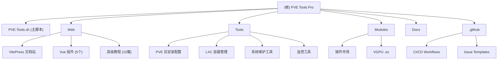
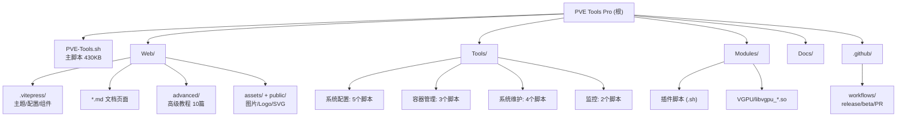

# PVE Tools Pro -- 项目总览

## 项目愿景

PVE Tools Pro 是一个面向 Proxmox VE 9.x 的交互式 Bash 运维工具集。目标是把高频、易错、需要大量人工检查的 PVE 运维动作收口为一个更清晰的菜单驱动工具，配合更严格的校验和更明确的高风险提示，降低误操作概率。

**官网**: https://pve.oowo.cc | **仓库**: https://github.com/PVE-Tools/PVE-Tools-9

## 架构总览



- **核心入口**: `PVE-Tools.sh`（约 430KB，单一 Bash 脚本），通过 `bash <(curl -sSL ...)` 方式分发执行。
- **文档站**: `Web/` 目录承载 VitePress 构建的官方文档网站，部署于 Cloudflare Pages。
- **辅助工具集**: `Tools/` 集成来自 tteck 社区的 13 个系统维护脚本。
- **插件市场**: `Modules/` 提供第三方脚本的自动发现与执行框架。
- **CI/CD**: `.github/workflows/` 提供 release、beta-release、pr-validation 三条流水线。

## 模块结构图



## 模块索引

| 模块路径 | 语言 | 职责 | 入口文件 | 文档 |
|---|---|---|---|---|
| `/` (根) | Bash | 主脚本，全部功能入口 | `PVE-Tools.sh` | `README.md` |
| `Web/` | TypeScript/Vue/Markdown | VitePress 文档站 | `Web/index.md`, `Web/.vitepress/config.mts` | [Web/CLAUDE.md](./Web/CLAUDE.md) |
| `Tools/` | Bash | 第三方系统维护脚本集 | 各 `.sh` 文件 | [Tools/CLAUDE.md](./Tools/CLAUDE.md) |
| `Modules/` | Bash/二进制 | 插件市场与模块 | `install-zsh.sh`, `VGPU/*.so` | [Modules/CLAUDE.md](./Modules/CLAUDE.md) |
| `Docs/` | Markdown | 补充文档 | `future-guide.md`, `README-EN.md` | -- |
| `.github/` | YAML | CI/CD 工作流与 Issue 模板 | `workflows/*.yml` | -- |

## 技术栈

| 层面 | 技术 | 版本/说明 |
|---|---|---|
| 运行环境 | Proxmox VE 9.x (Debian 13 Trixie) | 要求 root 权限 |
| 主脚本语言 | GNU Bash | 单一文件，通过 curl 管道分发执行 |
| 文档站构建 | VitePress | v1.6.4，部署于 Cloudflare Pages |
| 前端框架 | Vue 3 | v3.5.27，仅用于文档站主题组件 |
| 图标库 | lucide-vue-next | v0.563.0 |
| 运行时 | Bun | Web 目录依赖管理（bun.lock） |
| CI/CD | GitHub Actions | release / beta-release / PR validation |
| 编译工具 | shc | 将 Bash 编译为二进制（仅 release 流程） |
| 许可证 | GPL-3.0 | 详见 `LICENSE` |
| 分析 | Umami | 文档站匿名访问统计 |

## 运行与开发

### 使用脚本（用户侧）

```bash
# Cloudflare 短域名（推荐）
bash <(curl -sSL https://pve.oowo.cc/PVE-Tools.sh)

# 中国大陆网络
bash <(curl -sSL https://ghfast.top/raw.githubusercontent.com/PVE-Tools/PVE-Tools-9/main/PVE-Tools.sh)

# 国际网络 / 本地
wget https://raw.githubusercontent.com/PVE-Tools/PVE-Tools-9/main/PVE-Tools.sh
chmod +x PVE-Tools.sh
sudo ./PVE-Tools.sh
```

### 开发文档站（Web 模块）

```bash
cd Web
bun install          # 或 npm install
bun run dev          # 启动本地开发服务器
bun run build        # 构建到 .vitepress/dist/
bun run preview      # 预览构建结果
```

### CI/CD 流水线

- **PR 合并到 main/beta**: 触发 shellcheck、Bash 语法检查、版本一致性校验、安全扫描。
- **推送版本标签 (v*.*.*)**: 触发 Release 工作流，用 shc 编译二进制，自动生成 GitHub Release。
- **推送 beta/alpha 标签**: 触发 Beta Release 工作流。

## 测试策略

| 类型 | 方式 | 说明 |
|---|---|---|
| 语法检查 | `bash -n PVE-Tools.sh` | CI 中强制通过 |
| 静态分析 | `shellcheck -f gcc PVE-Tools.sh` | CI 中强制通过 |
| 版本一致性 | 比较脚本内 `CURRENT_VERSION` 与 `VERSION` 文件 | CI 中强制通过 |
| 安全扫描 | 检测 `eval`/`source` 使用 | CI 中告警 |
| 功能测试 | 手动在 PVE 9.x 环境验证 | 无自动化 E2E 测试 |

**注意**: 本项目目前没有自动化单元测试或集成测试。所有功能验证依赖人工在真实或模拟的 PVE 9.x 环境中测试。

## 编码规范

### Bash 脚本规范

- Shebang: `#!/bin/bash`
- 缩进: 4 空格
- 函数命名: `snake_case`（如 `vm_validate_new_vmid`、`host_network_get_bridges`）
- 变量命名: `UPPER_SNAKE`（全局配置常量）、`lower_case`（局部变量）
- 颜色: 通过 `setup_colors()` 统一管理 ANSI 颜色变量，兼容 `NO_COLOR` 环境变量
- 日志: 使用统一日志函数 `log_info`、`log_warn`、`log_error`、`log_step`、`log_success`、`log_tips`
- UI: 使用 `UI_BORDER`、`UI_DIVIDER`、`UI_HEADER`、`UI_FOOTER` 统一边框风格
- 风险控制: 高风险写入操作必须使用 `confirm_high_risk_action()` 要求输入确认词
- 配置备份: 修改系统配置文件前调用 `backup_file()` 自动备份到 `/var/backups/pve-tools/`
- 幂等性: GRUB 参数等配置通过专用幂等管理函数修改，支持增删查
- 日志文件: 所有操作记录到 `/var/log/pve-tools.log`

### 文档站 (Vue/TypeScript) 规范

- 使用 VitePress 默认主题扩展
- 自定义组件放置在 `Web/.vitepress/theme/components/`
- 组件使用 `<script setup>` + TypeScript
- 样式使用 scoped CSS

## AI 使用指引

- **主脚本分析**: `PVE-Tools.sh` 约 430KB，读取时建议使用 offset/limit 分段读取。关键函数区域: 颜色系统(23-55行)、日志系统(103-137行)、主菜单(5480-5499行)、VM 运维(6065+行)、宿主机网络(7873+行)。
- **模块理解**: 优先阅读各模块的 `CLAUDE.md` 而非直接扫描源代码。
- **忽略的构建产物**: `.vitepress/dist/`、`.vitepress/cache/`、`node_modules/` 均被 `.gitignore` 忽略且不参与分析。
- **二进制文件**: `Modules/VGPU/*.so` 只记录路径，不读取内容。

## 变更记录 (Changelog)

| 日期 | 变更 | 来源 |
|---|---|---|
| 2026-04-28 | 初始化 CLAUDE.md 体系（根 + Web + Tools + Modules） | claude-init 架构师（自适应版） |
